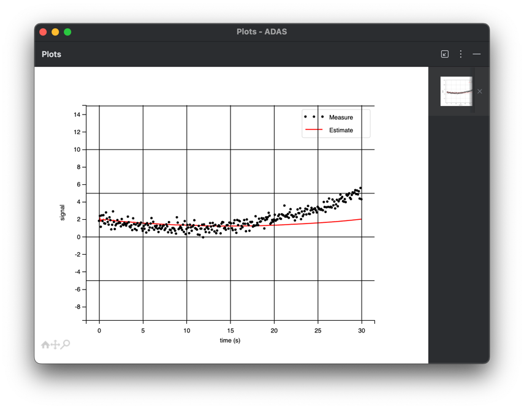
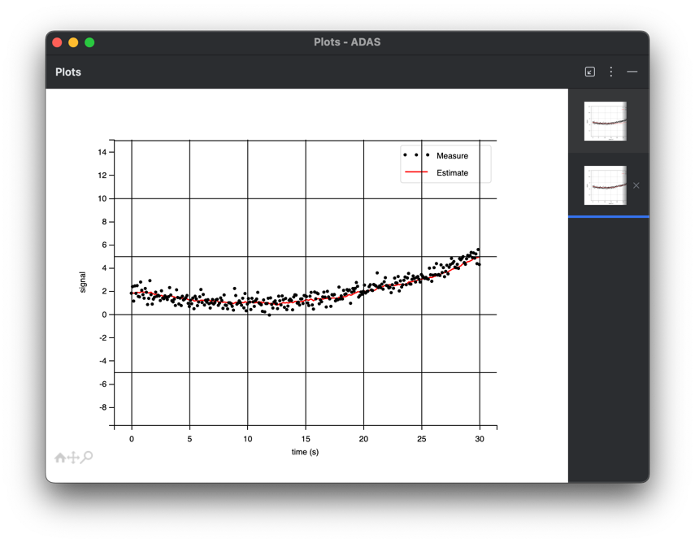
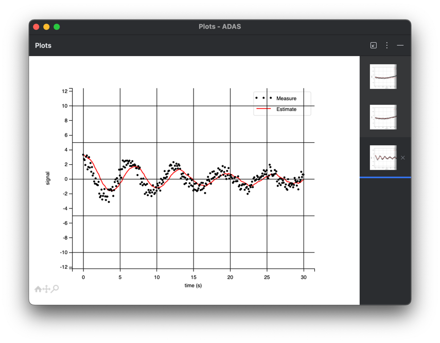
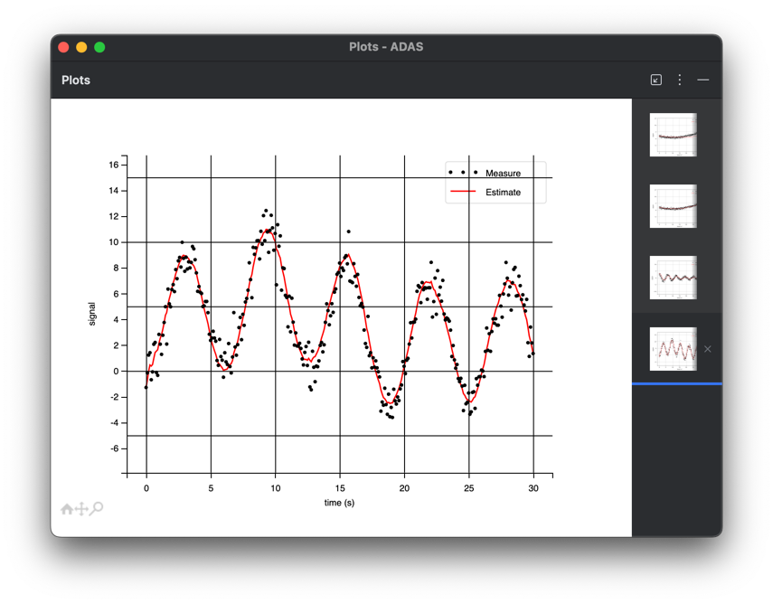
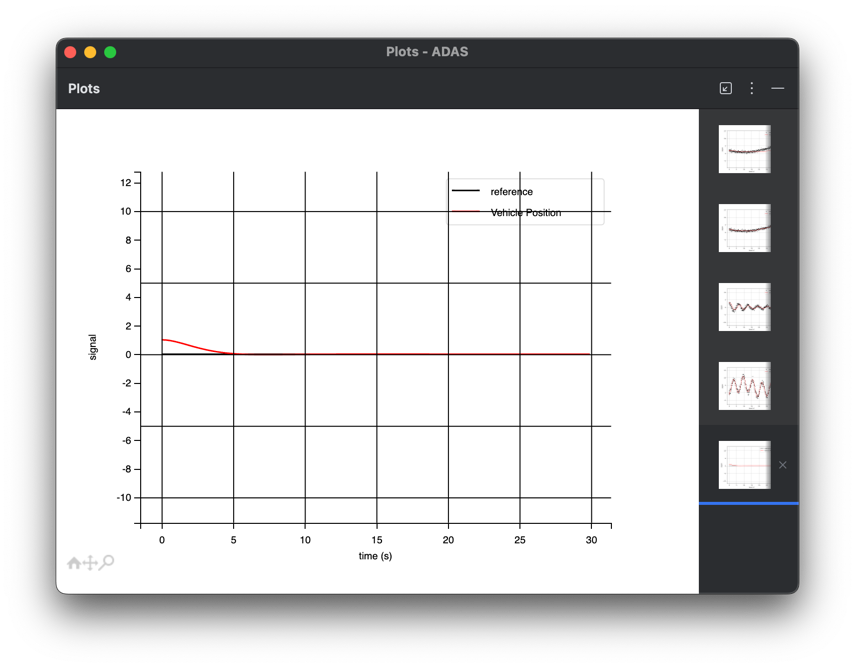
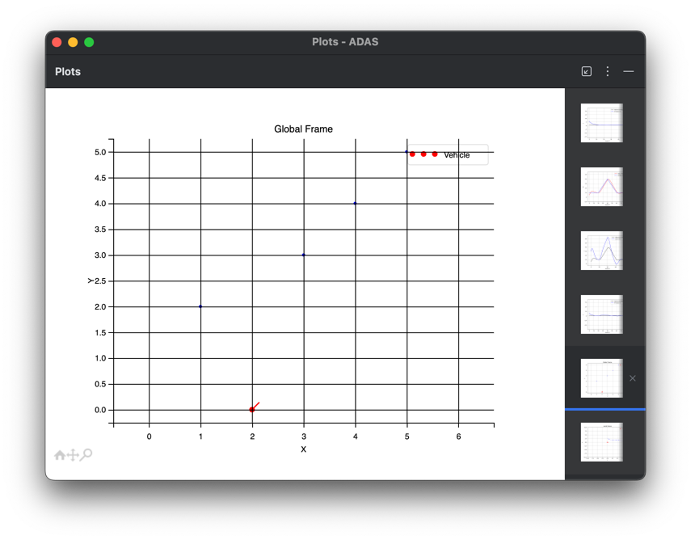
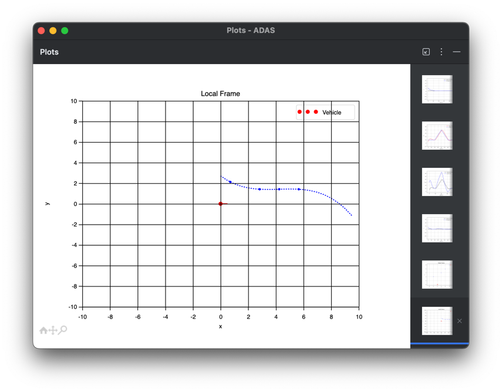

# ADAS 교육

### Filter
    AverageFilter
    
    동적인거 잘 못따라간다.

    MovingAverageFilter

    동적인거 잘 따라간다.

    
    LowPassFilter

    딜레이가 있다. 

    KalmanFilter.

    깔쌈한데 계산식이 많고 모델링을 해야한다

----------

### PID Control
    P -> 반응성
    I -> steady state err 잡기, 첫 ripple 발생시킴
    D -> ripple줄이는데 반응성 낮게함

----------

### Global좌표계 Local 좌표계로 바꾸고, 추종곡선 그리기 
    차선에 그리는데 활용 

